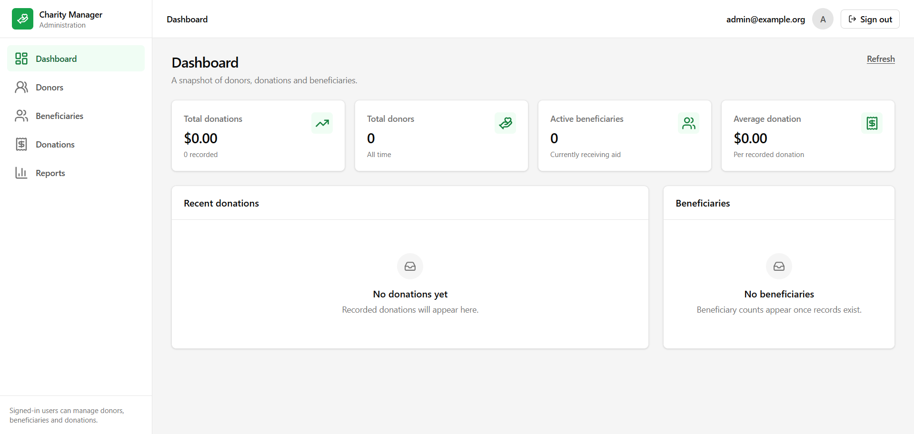

# NGO Charity Management System

A full-stack administration panel for a charity: track donors, record donations,
manage beneficiaries and report on giving.

- **Backend** — NestJS 12, Prisma 7, PostgreSQL, JWT authentication, Swagger
- **Frontend** — React 19, TypeScript 6, Vite 8, Tailwind CSS 3, TanStack Query

## Preview



## Contents

- [Preview](#preview)
- [Requirements](#requirements)
- [Quick start](#quick-start)
- [Environment variables](#environment-variables)
- [Creating the database](#creating-the-database)
- [Creating the first user](#creating-the-first-user)
- [Running the apps](#running-the-apps)
- [Available scripts](#available-scripts)
- [API reference](#api-reference)
- [Data model](#data-model)
- [Project layout](#project-layout)
- [Design notes](#design-notes)
- [Troubleshooting](#troubleshooting)
- [Contributing](#contributing)
- [Security](#security)
- [License](#license)

---

## Requirements

| Tool       | Version | Notes                                                                 |
| ---------- | ------- | --------------------------------------------------------------------- |
| Node.js    | 22.x    | Developed and verified on 22.14.0                                    |
| npm        | 11.x    | Ships with Node 22                                                     |
| PostgreSQL | 15+     | Any reachable instance works; the defaults target a local server      |

Check your versions:

```bash
node -v
npm -v
psql --version
```

## Quick start

From the repository root:

```bash
# 1. Install both workspaces
npm run install:all

# 2. Configure the backend (see "Environment variables" below)
cp backend/.env.example backend/.env
# Windows: copy backend\.env.example backend\.env

# 3. Create the database schema
npm --prefix backend run prisma:migrate:dev

# 4. Create an administrator account
npm --prefix backend run user:create -- admin@example.org "your-password"

# 5. Start the API (http://localhost:3000) and the web app (http://localhost:5173)
npm run dev:backend
npm run dev:frontend
```

Open <http://localhost:5173> and sign in with the account from step 4.

## Environment variables

Two files configure the system. Both are optional templates already in the
repository; neither is ever committed.

**`backend/.env`** — used by the API. Copy `backend/.env.example` and edit it:

| Variable          | Required | Default                 | Description                                                       |
| ----------------- | -------- | ----------------------- | ----------------------------------------------------------------- |
| `NODE_ENV`        | no       | `development`           | Runtime mode                                                      |
| `PORT`            | no       | `3000`                  | Port the API listens on                                           |
| `API_PREFIX`      | no       | `api`                   | Base path for all REST routes                                     |
| `DATABASE_URL`    | **yes**  | —                       | PostgreSQL connection string                                      |
| `CORS_ORIGIN`     | no       | `http://localhost:5173` | Comma-separated list of allowed browser origins                   |
| `JWT_SECRET`      | **yes**  | —                       | Secret for signing access tokens; at least 32 characters          |
| `JWT_EXPIRES_IN`  | no       | `1d`                    | Token lifetime; seconds or a span such as `30m`, `12h`, `7d`      |

Generate a strong `JWT_SECRET`:

```bash
node -e "console.log(require('crypto').randomBytes(48).toString('base64url'))"
```

The application validates its configuration on startup and refuses to boot with
a clear message if a required variable is missing or invalid, rather than
failing later at an unpredictable moment.

**`frontend/.env.local`** — optional. Only `VITE_API_BASE_URL` is read, and it
usually does not need to be set: in development Vite proxies `/api` to the
backend, so the browser stays same-origin and no CORS round trip occurs. Set it
only when the API is hosted elsewhere:

```bash
VITE_API_BASE_URL=https://api.charity.example.org/api
```

> Only variables prefixed with `VITE_` reach the browser bundle. Never put a
> secret in a `VITE_` variable — everything in `src/` ships to the client.

## Creating the database

The schema lives in `backend/prisma/schema.prisma` and is read by Prisma 7
through `backend/prisma.config.ts`.

Create the database itself, then let Prisma build the tables:

```bash
createdb charity            # Windows: createdb charity
npm --prefix backend run prisma:migrate:dev
```

`prisma:migrate:dev` creates the database tables and generates a migration in
`backend/prisma/migrations`. Use `prisma:migrate:deploy` in production, where
migrations must be applied without prompts.

Related commands:

```bash
npm --prefix backend run prisma:generate   # regenerate the client after schema edits
npm --prefix backend run prisma:studio     # browse data in a GUI
npm --prefix backend run prisma:validate   # check the schema
```

## Creating the first user

There is no sign-up flow; users are administrators created from the CLI. The
script reads the same `.env` as the API, so no connection details are needed on
the command line:

```bash
npm --prefix backend run user:create -- admin@example.org "a-strong-password"
npm --prefix backend run user:list
```

Accounts are created as `ADMIN` by default. Pass `--role=` for a lesser
account, which is the usual choice for day-to-day use:

```bash
npm --prefix backend run user:create -- staff@example.org "a-strong-password" --role=STAFF
npm --prefix backend run user:create -- auditor@example.org "a-strong-password" --role=VIEWER
```

| Role     | Can do                                                     |
| -------- | ---------------------------------------------------------- |
| `ADMIN`  | Everything, plus creating, changing and deleting accounts    |
| `STAFF`  | Create, edit and delete donors, donations and beneficiaries |
| `VIEWER` | Read-only access to every screen                             |

The role travels inside the JWT, so changing someone's role takes effect the
next time they sign in. An account with no role claim, which means a token
issued before roles existed, is treated as `VIEWER`.

`user:create` requires a valid email and a password of 8 to 72 characters, and
refuses to overwrite an existing address, so it is safe to run twice. It prompts
for a hidden password when run with no arguments.

`POST /api/users`, `PATCH /api/users/:id/role` and `DELETE /api/users/:id` do
the same job over HTTP and require `ADMIN`. The system refuses to demote or
delete the final administrator, which would leave nobody able to manage
accounts.

## Running the apps

Run the two processes in separate terminals.

```bash
npm run dev:backend    # NestJS on http://localhost:3000, Swagger at /api/docs
npm run dev:frontend   # Vite on http://localhost:5173
```

| URL                             | What it serves                              |
| ------------------------------- | ------------------------------------------- |
| <http://localhost:5173>         | The web application                         |
| <http://localhost:3000/api>     | The REST API                                |
| <http://localhost:3000/api/docs>| Interactive Swagger documentation           |
| <http://localhost:3000/api/health> | Liveness probe, public                   |

For a production-style check, build both and serve the compiled output:

```bash
npm run build
npm --prefix frontend run preview   # http://localhost:4173
```

## Available scripts

Run from the repository root:

| Script                  | Description                                             |
| ----------------------- | ------------------------------------------------------- |
| `npm run install:all`   | Install backend and frontend dependencies               |
| `npm run dev:backend`   | Start the API in watch mode                            |
| `npm run dev:frontend`  | Start the Vite dev server                              |
| `npm run build`         | Build both workspaces                                  |
| `npm run lint`          | Lint both workspaces                                   |
| `npm run lint:fix`      | Lint and apply fixable fixes                           |
| `npm run typecheck`     | Type-check both workspaces                             |
| `npm run format`        | Format source with Prettier                            |
| `npm run format:check`  | Verify formatting without writing                      |
| `npm run prisma:generate` | Regenerate the Prisma client                        |

Backend-specific scripts (`npm --prefix backend run <script>`) include
`prisma:migrate:dev`, `prisma:migrate:deploy`, `prisma:studio`,
`user:create`, `user:list`, `start:dev` and `start:prod`.

## API reference

Base URL: `http://localhost:3000/api`. Every route below except health and
login requires an `Authorization: Bearer <token>` header.

**Health**

| Method | Path            | Auth | Description                    |
| ------ | --------------- | ---- | ------------------------------ |
| GET    | `/health`       | no   | Liveness probe                 |

**Authentication**

| Method | Path          | Auth | Description                        |
| ------ | ------------- | ---- | ---------------------------------- |
| POST   | `/auth/login` | no   | Sign in, returns a JWT and profile |
| GET    | `/auth/me`    | yes  | The currently signed-in user       |

**Users** — every route requires the `ADMIN` role

| Method | Path                 | Auth  | Description                                    |
| ------ | -------------------- | ----- | ---------------------------------------------- |
| GET    | `/users`             | admin | List every account                             |
| POST   | `/users`             | admin | Create an account with a role                  |
| PATCH  | `/users/:id/role`    | admin | Change an account's role                       |
| DELETE | `/users/:id`         | admin | Delete an account; the last admin is protected |

**Donors**

| Method | Path                      | Auth | Description                                |
| ------ | ------------------------- | ---- | ------------------------------------------ |
| GET    | `/donors`                 | yes  | List; `page`, `pageSize`, `search`          |
| POST   | `/donors`                 | yes  | Create                                     |
| GET    | `/donors/:id`             | yes  | Fetch one                                  |
| PATCH  | `/donors/:id`             | yes  | Update                                     |
| DELETE | `/donors/:id`             | yes  | Delete, cascading to their donations       |
| GET    | `/donors/:id/donations`   | yes  | Donation history, newest first             |

**Beneficiaries**

| Method | Path                  | Auth | Description                                              |
| ------ | --------------------- | ---- | -------------------------------------------------------- |
| GET    | `/beneficiaries`      | yes  | List; `page`, `pageSize`, `search`, `category`, `status` |
| POST   | `/beneficiaries`      | yes  | Create                                                   |
| GET    | `/beneficiaries/:id`  | yes  | Fetch one                                                |
| PATCH  | `/beneficiaries/:id`  | yes  | Update                                                   |
| DELETE | `/beneficiaries/:id`  | yes  | Delete                                                   |

**Donations**

| Method | Path                 | Auth | Description                                                          |
| ------ | -------------------- | ---- | -------------------------------------------------------------------- |
| GET    | `/donations`         | yes  | List; `page`, `pageSize`, `search`, `donorId`, `from`, `to`, `minAmount`, `maxAmount` |
| POST   | `/donations`         | yes  | Create                                                                 |
| GET    | `/donations/:id`     | yes  | Fetch one                                                              |
| PATCH  | `/donations/:id`     | yes  | Update                                                                 |
| DELETE | `/donations/:id`     | yes  | Delete                                                                 |

**Dashboard**

| Method | Path         | Auth | Description                                     |
| ------ | ------------ | ---- | ----------------------------------------------- |
| GET    | `/dashboard` | yes  | Totals, recent donations, beneficiary breakdown |

**Reports**

| Method | Path                              | Auth | Description                                            |
| ------ | --------------------------------- | ---- | ------------------------------------------------------ |
| GET    | `/reports/donations`              | yes  | Summary, monthly totals, top donors; `from`, `to`, `year`, `search` |
| GET    | `/reports/donations/list`         | yes  | The same filters, paginated                           |
| GET    | `/reports/donations/export`       | yes  | Every matching donation as a CSV download              |

### Conventions

**Pagination.** List endpoints return:

```json
{
  "data": [],
  "meta": {
    "total": 0,
    "page": 1,
    "pageSize": 10,
    "totalPages": 0,
    "hasNextPage": false,
    "hasPreviousPage": false
  }
}
```

**Errors.** A single exception filter produces one shape everywhere:

```json
{
  "statusCode": 400,
  "message": "The request contains invalid values.",
  "error": "Bad Request",
  "path": "/api/donors",
  "method": "POST",
  "timestamp": "2026-01-01T00:00:00.000Z",
  "errors": ["fullName should not be empty"]
}
```

| Status | Meaning                                                        |
| ------ | -------------------------------------------------------------- |
| 400    | Validation failed; `errors` lists every offending field         |
| 401    | Missing, malformed or expired token                             |
| 404    | Record not found                                                |
| 409    | Duplicate or conflicting data                                   |
| 429    | Rate limit exceeded                                             |
| 503    | Database unreachable; the API stays up and reports it cleanly   |

**Money.** Amounts are stored as PostgreSQL `Decimal(14,2)` to avoid floating
point drift, and serialised as JSON numbers.

**Dates.** `donationDate` is a calendar date with no time component. It is
stored and returned as `YYYY-MM-DD` and never shifted by a timezone. The
`from` and `to` filters accept the same format; an inverted range is rejected
with 400.

## Data model

```
User
  id, email (unique), password, role, createdAt, updatedAt

Donor
  id, fullName, email, phone, address, createdAt, updatedAt
  └──< Donation   (deleting a donor removes their donations)

Donation
  id, donorId, amount Decimal(14,2), donationDate Date, notes, createdAt, updatedAt

Beneficiary
  id, fullName, phone, category, status, createdAt, updatedAt
```

`User.role` is `ADMIN | STAFF | VIEWER` and defaults to `VIEWER`. `password`
stores a bcrypt hash and is never returned by the API.
`Beneficiary.category` is `FOOD | EDUCATION | MEDICAL`.
`Beneficiary.status` is `ACTIVE | INACTIVE`.

Columns are mapped to `snake_case` in PostgreSQL while the API and the
TypeScript client use `camelCase`.

## Project layout

```
.
├── backend/
│   ├── prisma/
│   │   ├── schema.prisma        # data model
│   │   └── migrations/          # generated by prisma migrate
│   ├── src/
│   │   ├── common/              # guards, filters, interceptors, utils
│   │   ├── config/              # validated environment configuration
│   │   ├── modules/
│   │   │   ├── auth/            # login, JWT, user CLI
│   │   │   ├── donors/
│   │   │   ├── beneficiaries/
│   │   │   ├── donations/
│   │   │   ├── dashboard/
│   │   │   └── reports/         # summaries and CSV export
│   │   ├── app.module.ts
│   │   └── main.ts              # bootstrap: /api, CORS, Swagger
│   └── prisma.config.ts
├── frontend/
│   └── src/
│       ├── components/
│       │   ├── ui/              # reusable primitives
│       │   ├── layout/          # shell, sidebar, top bar
│       │   └── feedback/        # toasts
│       ├── context/             # auth and toast providers
│       ├── features/            # per-domain API and queries
│       │   ├── donors/
│       │   ├── beneficiaries/
│       │   ├── donations/
│       │   ├── dashboard/
│       │   └── reports/
│       ├── hooks/
│       ├── lib/                 # API client, formatting, query client
│       ├── pages/               # one component per route
│       ├── routes/              # router and route guards
│       └── types/               # API types shared by the app
├── package.json                 # workspace-level scripts
├── assets/                      # images used by this README
├── CONTRIBUTING.md
├── CODE_OF_CONDUCT.md
├── SECURITY.md
└── README.md
```

## Design notes

A few decisions worth knowing before changing the code.

**Authentication is deny by default.** The JWT guard is registered globally, so
a new route is protected automatically. A route opts out with `@Public()`.
Password comparison always runs, even for an unknown email, so response timing
does not reveal which accounts exist. Login attempts are rate limited.

**Money never touches a float.** `Decimal(14,2)` in the database, converted
once at the API boundary.

**The API is ESM.** NestJS 12 is ESM-only, so the backend is
`"type": "module"` with TypeScript `nodenext`. Relative imports carry an
explicit `.js` extension. Note that `nest build` is not used: the backend
compiles with `tsc`, and `concurrently` runs the dev processes.

**Prisma 7 driver adapters.** Prisma 7 connects through `@prisma/adapter-pg`,
and the datasource URL is configured in `backend/prisma.config.ts` rather than
inside the schema.

**The frontend is same-origin in development.** Vite proxies `/api` to port
3000, so there is no preflight and the session survives reloads. Set
`VITE_API_BASE_URL` only for a cross-origin deployment.

**Sessions are verified, not assumed.** A token in `localStorage` is not proof
of a valid session, so the app confirms it with `/auth/me` before rendering
protected routes. A 401 from any request clears the session immediately.

**Lists use stale-while-revalidate.** Paging or filtering keeps the previous
rows on screen while the next page loads, so the table does not flash empty.

**Tables become cards on small screens.** Below the `sm` breakpoint each row
renders as a labelled card, so data stays readable on a phone instead of
forcing horizontal scrolling.

**The UI is deliberately neutral.** White, black and gray with one green
accent, no gradients, and visible focus rings throughout.

## Troubleshooting

**`Cannot find module '@prisma/client'`** — the client has not been generated:

```bash
npm run prisma:generate
```

**Driver errors after changing `schema.prisma`** — the generated client is
stale. Run `npm run prisma:generate`, then restart the dev server.

**Port 3000 or 5173 is already in use** — change `PORT` in `backend/.env`, or
the port in `frontend/vite.config.ts` (the proxy target must match `PORT`).

**`503 Service Unavailable` on every request** — the API cannot reach
PostgreSQL. Confirm the server is running and that `DATABASE_URL` matches it.
`/api/health` responds even when the database is down, which distinguishes a
connection problem from an application problem.

**`401` immediately after signing in** — the stored token has expired or
`JWT_SECRET` changed between requests. Sign out and in again.

**`429` during development** — the rate limit was reached. The whole API allows
300 requests per minute and `/auth/login` allows 10. Wait for the window to
reset, or raise the limit in `backend/src/modules/auth/auth.module.ts`
(global) or the `@Throttle` decorator in
`backend/src/modules/auth/auth.controller.ts` (login).

**`403 Forbidden` on a save** — the signed-in account is a `VIEWER`, which is
read-only. Sign in with a `STAFF` or `ADMIN` account. Note the web app does not
yet hide the write buttons for viewers, so the request is what gets refused.

**Changes to the schema are not applied** — remember `prisma migrate dev`
updates both the database and the migration history. Use
`npm --prefix backend run prisma:migrate:status` to see which migrations the
database has applied.

## Contributing

Bug reports and pull requests are welcome. See
[CONTRIBUTING.md](CONTRIBUTING.md) for the local setup and the checks every
change is expected to pass.

## Security

Please do not report vulnerabilities through public issues. See
[SECURITY.md](SECURITY.md) for how to report one privately.

## License

Released under the [MIT License](LICENSE).

This project is a starting point for a charity's own use. Review the
configuration, permissions, and data-handling requirements before adopting it
for real donor records.

